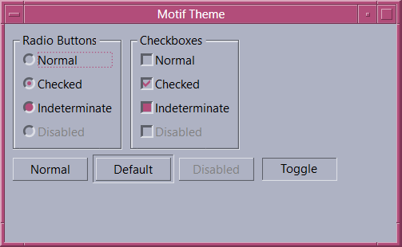

# Motif
Motif theme for WPF

The Motif theme contains styles for WPF controls, including custom window frame. The ultimate goal of the project is to provide a consistent look and feel across all controls.

